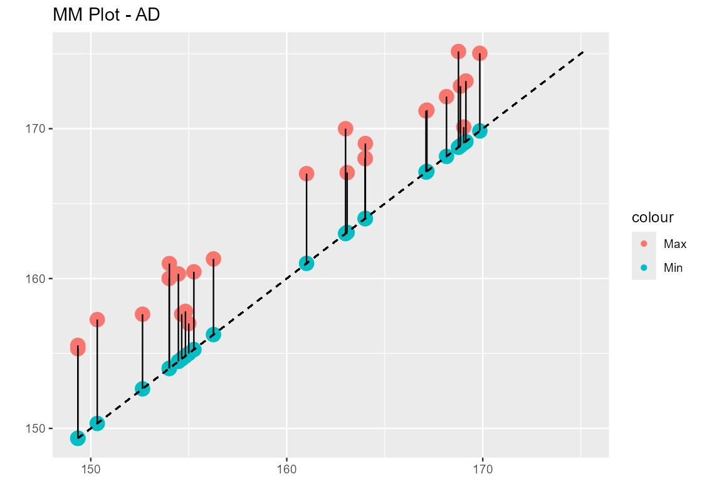
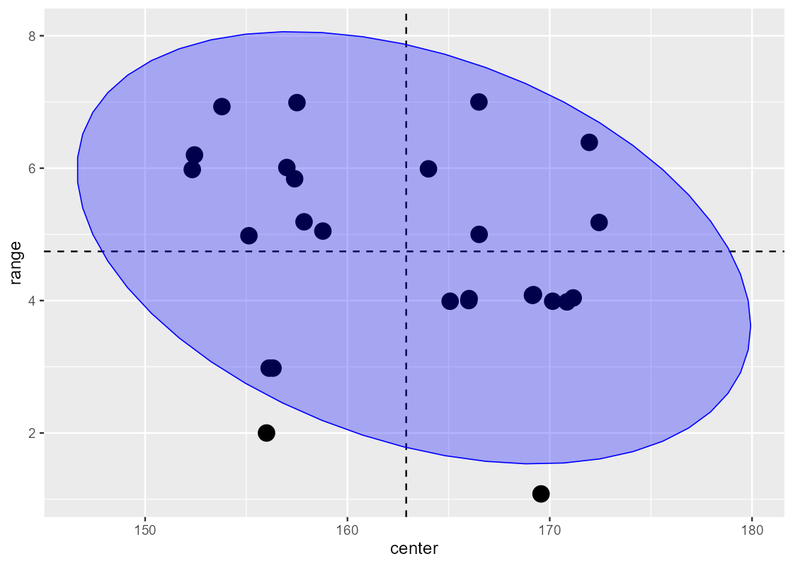
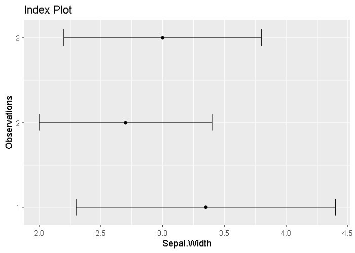
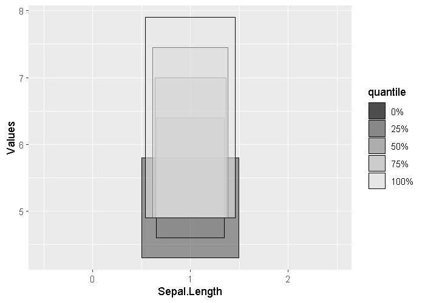
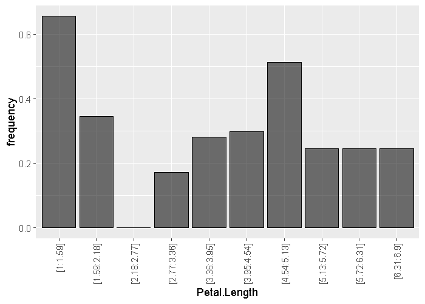
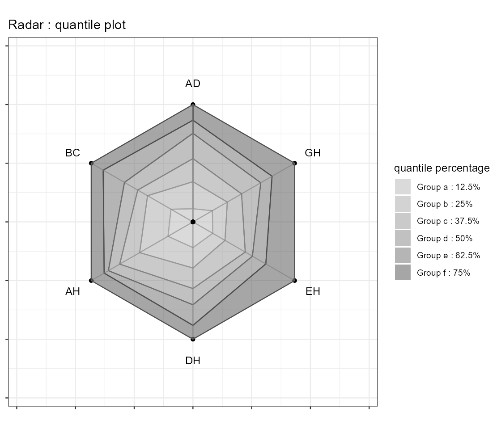

# ggInterval

**ggInterval** (formerly **ggESDA**) is an R package for visualizing interval-valued symbolic data using `ggplot2`.

## Overview

Exploratory data analysis (EDA) relies on graphical summaries such as boxplots, histograms, and scatterplots. Yet modern data are increasingly structurally rich: single observations may be recorded not as scalars but as intervals, histograms, or full empirical distributions — collectively known as **symbolic data**. Conventional graphics cannot natively accommodate these objects.

**ggInterval** bridges this gap by extending `ggplot2` to support interval-valued data. It provides seamless integration with the `ggplot2` workflow, enabling analysts to uncover structure and anomalies in interval-valued data that would remain hidden with traditional scalar-oriented graphics.

## Installation

Install the released version from CRAN:

```r
install.packages("ggInterval")
```

Or install the development version from GitHub:

```r
# install.packages("devtools")
devtools::install_github("hanmingwu1103/ggInterval")
```

## Features

### Visualization Functions

| Function | Description |
|---|---|
| `ggInterval_scatterplot` | Scatter plot for two continuous interval variables |
| `ggInterval_scatterMatrix` | Scatter plot matrix for all continuous interval variables |
| `ggInterval_3Dscatterplot` | 3D scatter plot for three interval variables |
| `ggInterval_MMplot` | Min-max plot showing the range of each observation |
| `ggInterval_CRplot` | Center-range plot showing the relation between center and range |
| `ggInterval_indexplot` | Index plot displaying the range of each observation with margin bars |
| `ggInterval_indexImage` | Index image plot |
| `ggInterval_hist` | Histogram for interval data |
| `ggInterval_2Dhist` | 2D histogram for interval data |
| `ggInterval_2DhistMatrix` | 2D histogram matrix for interval data |
| `ggInterval_boxplot` | Boxplot for interval data |
| `ggInterval_radarplot` | Radar plot with multiple interval variables |
| `ggInterval_PCA` | PCA biplot for interval data |

### Data Transformation

| Function | Description |
|---|---|
| `classic2sym` | Convert classical data to symbolic interval data via clustering or custom methods |
| `RSDA2sym` | Convert RSDA symbolic objects to ggInterval format |

## Quick Start

```r
library(ggInterval)

# Convert classical data to symbolic interval data
myIris <- classic2sym(iris, groupby = "Species")$intervalData
```

### Min-Max Plot

```r
ggInterval_MMplot(myIris, aes(Sepal.Length))
```

<p align="center">
  
</p>

### Center-Range Plot

```r
ggInterval_CRplot(myIris, aes(Sepal.Length))
```

<p align="center">
  
</p>

### Index Plot

```r
ggInterval_indexplot(myIris, aes(x = Sepal.Width))
```

<p align="center">
  
</p>

### Boxplot

```r
ggInterval_boxplot(myIris, aes(x = Sepal.Length))
```

<p align="center">
  
</p>

### Histogram

```r
ggInterval_hist(myIris, aes(x = Petal.Length))
```

<p align="center">
  
</p>

### Radar Plot

```r
ggInterval_radarplot(myIris, plotPartial = 1:3, showLegend = TRUE)
```

<p align="center">
  
</p>

## Links

- **CRAN**: <https://CRAN.R-project.org/package=ggInterval>
- **Homepage**: <https://hmwu.idv.tw/ggInterval/>
- **Vignette**: [ggInterval_Jiang&Wu.pdf](https://hmwu.idv.tw/ggInterval/ggInterval_Jiang&Wu.pdf)

## Citation

Jiang, B.S. and Wu, H.M. (2025), ggInterval: an R package for visualizing interval-valued data using ggplot2. R package version 0.2.2, https://CRAN.R-project.org/package=ggInterval.

## License

GPL (>= 2)
