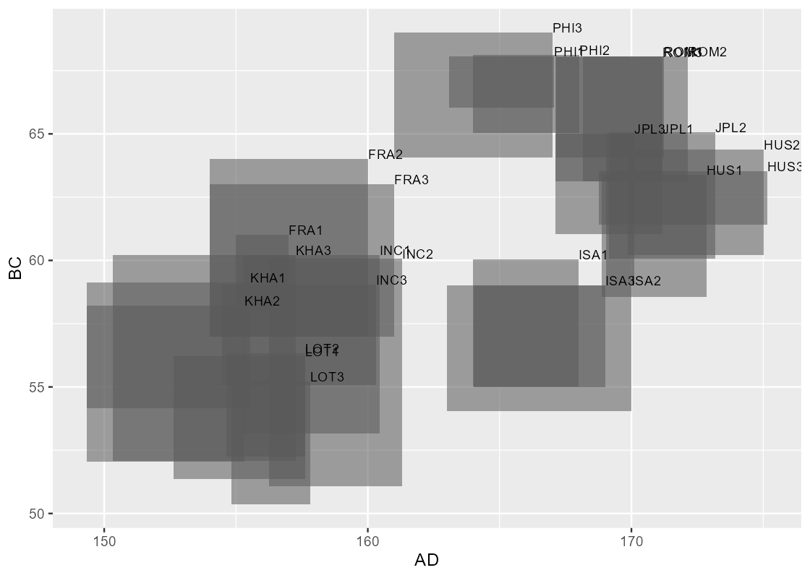
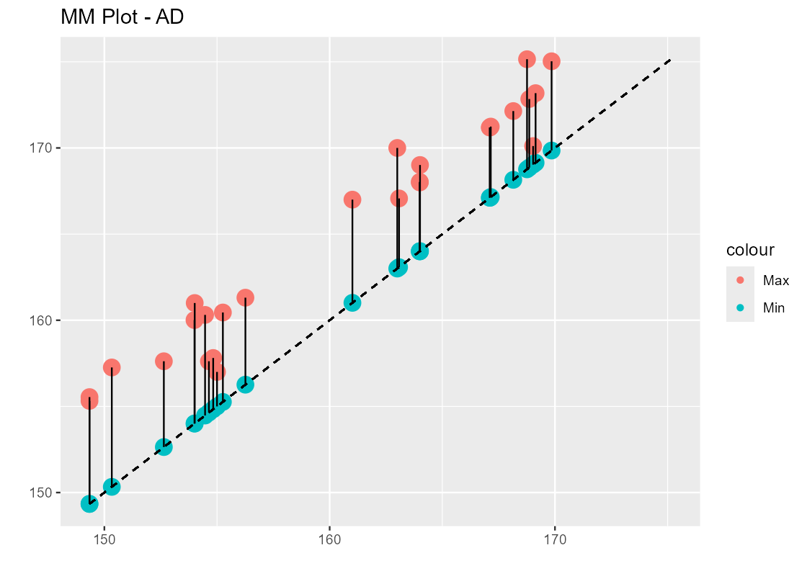
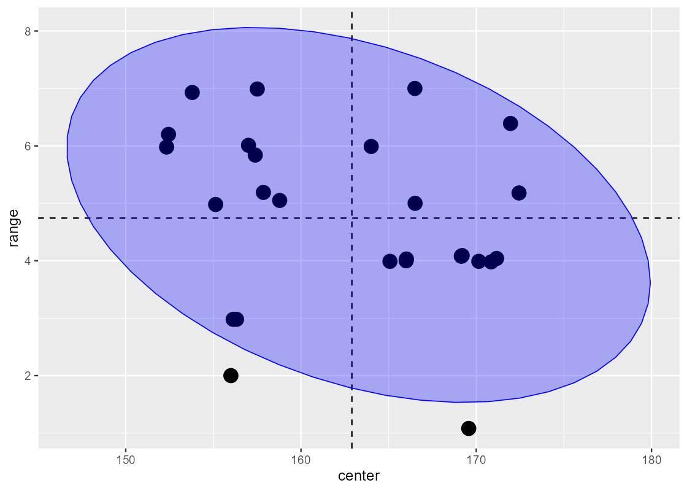
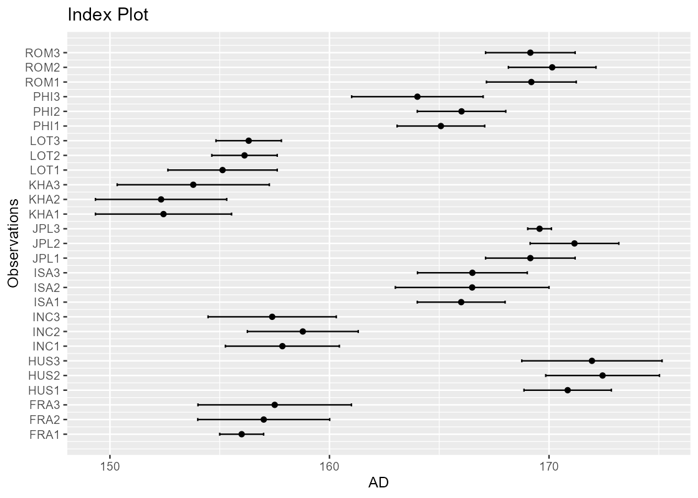
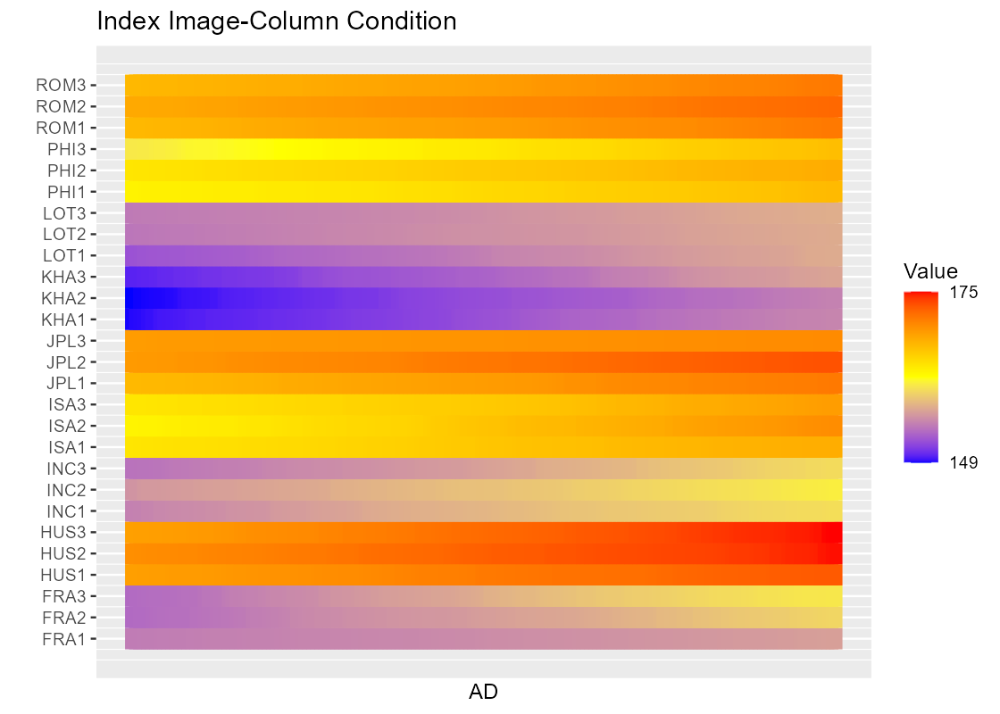
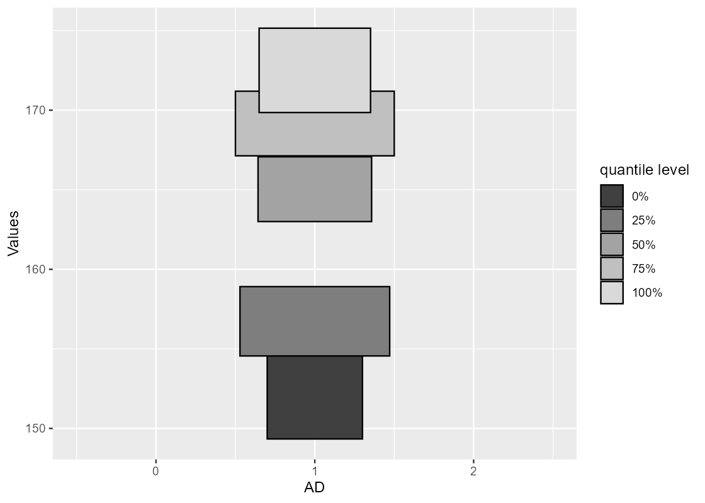
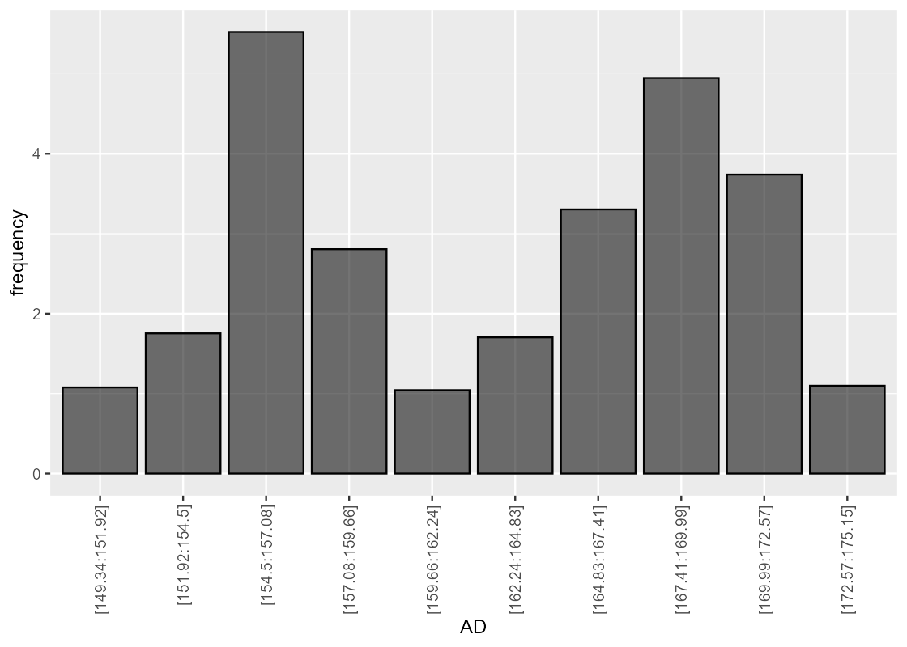
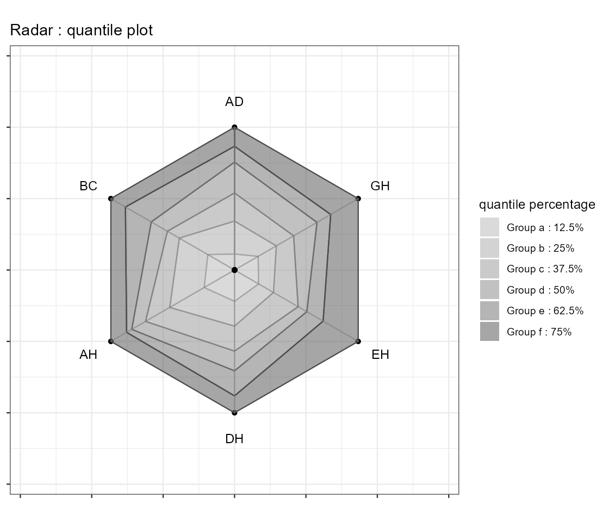

# ggInterval

[](https://CRAN.R-project.org/package=ggInterval)
[](https://github.com/hanmingwu1103/ggInterval/releases)
[](https://www.gnu.org/licenses/old-licenses/gpl-2.0.en.html)

**ggInterval** extends `ggplot2` for interval-valued data. It provides
plotting functions, data conversion helpers, and examples for symbolic data
analysis workflows where each unit is described by lower and upper bounds
rather than a single point.

The package was previously released as **ggESDA**. The current development line
focuses on interval-valued visualization and companion tools for building
interval data from classical tables.

## Highlights in 0.2.5

- Adds interval-valued correlation heatmaps through `ggInterval_corrplot()`.
- Adds `ggInterval_lineplot()` for interval time-series style displays, with
  `ggInterval_tsplot()` retained as a backward-compatible alias.
- Updates histogram, 2D histogram, scatter, radar, PCA, and index-image
  examples and smoke tests.
- Standardizes package citation metadata and dataset/reference documentation.
- Includes tests for symbolic covariance and correlation method mappings.

## Installation

Install the CRAN release:

```r
install.packages("ggInterval")
```

Install the latest GitHub release:

```r
# install.packages("remotes")
remotes::install_github("hanmingwu1103/ggInterval@v0.2.5")
```

Install the current development version:

```r
# install.packages("remotes")
remotes::install_github("hanmingwu1103/ggInterval")
```

## Quick Start

```r
library(ggInterval)

# Convert classical data to interval-valued data
iris_i <- classic2sym(iris, groupby = "Species")$intervalData

# Scatter plot
ggInterval_scatterplot(iris_i, aes(x = Petal.Length, y = Petal.Width))

# Histogram
ggInterval_hist(iris_i, aes(x = Petal.Length), method = "equal-bin")

# 2D histogram with non-equidistant bins
ggInterval_2Dhist(
  iris_i,
  aes(x = Petal.Length, y = Sepal.Length),
  method = "unequal-bin"
)$plot

# Correlation heatmap
ggInterval_corrplot(iris_i, method = "BG", triangle = "lower")
```

## Main Functions

### Visualization

| Function | Description |
| --- | --- |
| `ggInterval_scatterplot()` | Scatter plot for two interval-valued variables |
| `ggInterval_scatterMatrix()` | Scatter plot matrix for interval-valued variables |
| `ggInterval_3Dscatterplot()` | 3D scatter plot for three interval-valued variables |
| `ggInterval_hist()` | Histogram with equal-bin or unequal-bin construction |
| `ggInterval_2Dhist()` | 2D histogram with equal-bin or unequal-bin construction |
| `ggInterval_2DhistMatrix()` | Matrix of 2D histograms |
| `ggInterval_MMplot()` | Min-max plot |
| `ggInterval_CRplot()` | Center-range plot |
| `ggInterval_indexplot()` | Index plot |
| `ggInterval_indexImage()` | Index image plot |
| `ggInterval_boxplot()` | Boxplot for interval-valued variables |
| `ggInterval_radarplot()` | Radar plot |
| `ggInterval_lineplot()` | Line plot for interval-valued data |
| `ggInterval_PCA()` | PCA display for interval-valued data |
| `ggInterval_corrplot()` | Correlation heatmap for interval-valued variables |

### Data Conversion

| Function | Description |
| --- | --- |
| `classic2sym()` | Convert classical data to interval-valued data |
| `RSDA2sym()` | Convert RSDA symbolic objects to `ggInterval` format |

## Example Graphics

### Scatter Plot

```r
ggInterval_scatterplot(iris_i, aes(x = Petal.Length, y = Petal.Width))
```

<p align="center">
  
</p>

### Min-Max Plot

```r
ggInterval_MMplot(iris_i, aes(Sepal.Length))
```

<p align="center">
  
</p>

### Center-Range Plot

```r
ggInterval_CRplot(iris_i, aes(Sepal.Length))
```

<p align="center">
  
</p>

### Index Plot

```r
ggInterval_indexplot(iris_i, aes(x = Sepal.Width))
```

<p align="center">
  
</p>

### Index Image

```r
ggInterval_indexImage(iris_i, aes(x = Sepal.Length))
```

<p align="center">
  
</p>

### Boxplot

```r
ggInterval_boxplot(iris_i, aes(x = Sepal.Length))
```

<p align="center">
  
</p>

### Histogram

```r
ggInterval_hist(iris_i, aes(x = Petal.Length))
```

<p align="center">
  
</p>

### Radar Plot

```r
ggInterval_radarplot(iris_i, plotPartial = 1:3, showLegend = TRUE)
```

<p align="center">
  
</p>

## Documentation

- CRAN: <https://CRAN.R-project.org/package=ggInterval>
- GitHub releases: <https://github.com/hanmingwu1103/ggInterval/releases>
- Issues: <https://github.com/hanmingwu1103/ggInterval/issues>

## Citation

Use the installed package citation metadata:

```r
citation("ggInterval")
```

The package citation is shipped with `inst/CITATION` and points to the
canonical CRAN package URL and DOI.

## License

GPL (>= 2)
